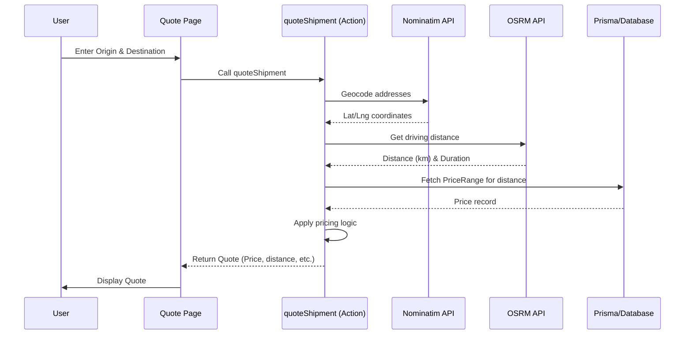
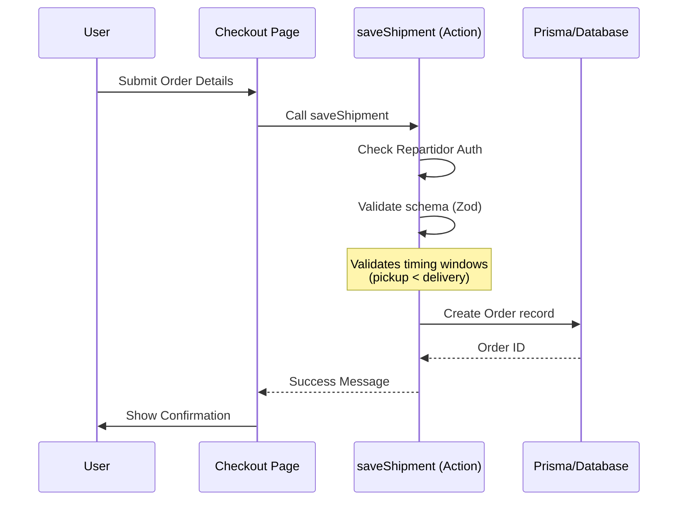

# Architecture

This document describes the technical architecture and workflows of the Envíos DosRuedas platform.

## Tech Stack

- **Framework**: [Next.js](https://nextjs.org/) (App Router)
- **Language**: [TypeScript](https://www.typescriptlang.org/)
- **Database ORM**: [Prisma](https://www.prisma.io/)
- **AI Integration**: [Firebase Genkit](https://js.p.run/docs/genkit/) with Google Gemini
- **Styling**: [Tailwind CSS](https://tailwindcss.com/) & [Shadcn UI](https://ui.shadcn.com/)
- **Mapping & Routing**:
  - [OpenStreetMap (Nominatim)](https://nominatim.org/) for Geocoding
  - [OSRM](http://project-osrm.org/) for Routing and Distance calculation
  - [Leaflet](https://leafletjs.com/) for Map visualization

## System Workflows

### 1. Shipment Quoting Workflow

The quoting process involves geocoding addresses and calculating distances before applying business rules for pricing.

### 2. Order Creation Workflow

Orders require an authenticated session (simulated as a `repartidor` in dev) and complex validation of timing windows.

## AI Architecture

The application uses **Genkit** to manage AI workflows.

- **Initialization**: Centralized in `src/ai/genkit.ts`.
- **Flows**: Defined in `src/ai/flows/`.
- **Deployment**: Integrated as Server Actions for seamless client-side usage via `useActionState`.
